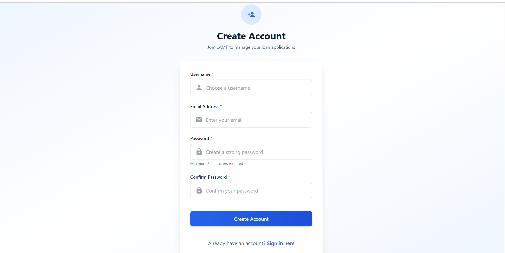

# House of EdTech - Smart Assignment & Evaluation System

A comprehensive full-stack educational platform designed to streamline assignment management, submission handling, and evaluation processes for teachers and students. This production-grade system features AI-powered feedback generation, role-based access control, and a modern, responsive user interface.

## Project Overview

The **House of EdTech** platform is an intelligent assignment management system that bridges the gap between educators and students. It provides a seamless workflow for creating assignments, submitting work, and receiving detailed evaluations with AI-assisted feedback. The system is built with scalability, security, and user experience as core principles.

### Key Features

- **Secure Authentication**: JWT-based authentication with access and refresh tokens
- **Role-Based Access Control**: Separate interfaces and permissions for Teachers and Students
- **Assignment Management**: Create, publish, and manage assignments with deadlines
- **File Submission System**: Upload and manage assignment submissions with version control
- **AI-Powered Feedback**: Automated grammar and clarity analysis for submissions
- **Evaluation Dashboard**: Comprehensive tools for teachers to evaluate and provide feedback
- **Responsive Design**: Modern UI built with Next.js and Tailwind CSS
- **Security First**: Rate limiting, CORS, input validation, and secure file handling

---

## Project Screenshots




---

## Approach

### Architecture 

The project follows a **layered architecture** with clear separation of concerns:

1. **Presentation Layer (Frontend)**: Next.js 16 with React 19, providing server-side rendering and optimal performance
2. **API Layer (Backend)**: RESTful API built with Express.js and TypeScript
3. **Business Logic Layer**: Service-oriented architecture with dedicated services for authentication, AI processing, and file management
4. **Data Layer**: MongoDB with Mongoose ODM for flexible schema design

### Design Patterns

- **MVC Pattern**: Controllers handle requests, Models define data structure, Services contain business logic
- **Middleware Chain**: Authentication, authorization, validation, and error handling through middleware
- **Repository Pattern**: Abstracted data access through Mongoose models
- **Service Abstraction**: AI service abstraction allows easy provider swapping

### Development Approach

- **Type Safety**: Full TypeScript implementation across frontend and backend
- **Validation First**: Zod schemas for runtime type checking and validation
- **Error Handling**: Centralized error handling with proper HTTP status codes
- **Security by Default**: Helmet, CORS, rate limiting, and input sanitization
- **Scalability**: Connection pooling, compression, and optimized database queries

---

## Tech Stack

### Frontend

| Technology | Version | Purpose |
|------------|---------|---------|
| **Next.js** | 16.1.0 | React framework with SSR and routing |
| **React** | 19.2.3 | UI library for building components |
| **TypeScript** | 5.x | Type-safe JavaScript |
| **Tailwind CSS** | 4.x | Utility-first CSS framework |
| **React Hook Form** | 7.69.0 | Form state management |
| **Zod** | 4.2.1 | Schema validation |
| **Radix UI** | Latest | Accessible component primitives |
| **Lucide React** | 0.562.0 | Icon library |

### Backend

| Technology | Version | Purpose |
|------------|---------|---------|
| **Node.js** | 18+ | JavaScript runtime |
| **Express.js** | 4.18.2 | Web application framework |
| **TypeScript** | 5.3.3 | Type-safe JavaScript |
| **MongoDB** | 5+ | NoSQL database |
| **Mongoose** | 8.0.3 | MongoDB object modeling |
| **JWT** | 9.0.2 | Authentication tokens |
| **bcryptjs** | 2.4.3 | Password hashing |
| **Zod** | 3.22.4 | Schema validation |
| **Multer** | 1.4.5 | File upload handling |
| **Cloudinary** | 2.8.0 | Cloud-based file storage |
| **Helmet** | 7.1.0 | Security headers |
| **CORS** | 2.8.5 | Cross-origin resource sharing |
| **express-rate-limit** | 7.1.5 | Rate limiting |

### Development Tools

- **ESLint**: Code linting and quality checks
- **Prettier**: Code formatting
- **Nodemon**: Development server auto-reload
- **ts-node**: TypeScript execution in Node.js

---

## Pros & Advantages

### **Security & Reliability**
- JWT-based authentication with refresh token rotation
- Password hashing with bcrypt (12 rounds)
- Rate limiting to prevent abuse (100 req/15min general, 5 req/15min auth)
- Helmet security headers for XSS, clickjacking protection
- CORS configuration for controlled cross-origin access
- Input validation with Zod schemas
- SQL injection prevention through parameterized queries

### **Developer Experience**
- Full TypeScript support for type safety
- Modular architecture for easy maintenance
- Comprehensive error handling
- Reusable middleware and utilities

###  **User Experience**
- Role-based dashboards (Teacher/Student)
- ntuitive file upload system
- Real-time submission status tracking
- AI-powered feedback generation
- Version control for submissions
- Late submission detection and tracking
- Responsive design for all devices


### **Production Ready**
- Environment-based configuration
- Graceful shutdown handling
- Health check endpoints
- Error logging and monitoring
- Database connection error handling

---

## APIs and Logic

### Authentication APIs

#### `POST /api/auth/register`
**Purpose**: User registration with role assignment  
**Logic**:
- Validates email, password, name, and role
- Checks for existing user with same email
- Hashes password with bcrypt (12 rounds)
- Creates user document in MongoDB
- Returns user data (excluding password)

**Request Body**:
```json
{
  "email": "user@example.com",
  "password": "securePassword123",
  "name": "John Doe",
  "role": "STUDENT" | "TEACHER"
}
```

#### `POST /api/auth/login`
**Purpose**: User authentication and token generation  
**Logic**:
- Validates credentials
- Compares hashed password
- Generates JWT access token (15min expiry)
- Generates JWT refresh token (7 days expiry)
- Returns tokens and user profile

**Request Body**:
```json
{
  "email": "user@example.com",
  "password": "securePassword123"
}
```

#### `POST /api/auth/refresh`
**Purpose**: Refresh expired access tokens  
**Logic**:
- Validates refresh token
- Verifies token signature and expiry
- Generates new access token
- Returns new access token

#### `GET /api/auth/profile`
**Purpose**: Get authenticated user's profile  
**Logic**:
- Validates JWT access token via middleware
- Retrieves user from database
- Returns user profile (excluding password)

---

### Assignment APIs

#### `POST /api/assignments` (Teacher Only)
**Purpose**: Create a new assignment  
**Logic**:
- Validates teacher role via middleware
- Validates assignment data (title, description, deadline, etc.)
- Creates assignment document (initially unpublished)
- Returns created assignment

**Request Body**:
```json
{
  "title": "Essay on Climate Change",
  "description": "Write a 1000-word essay...",
  "deadline": "2025-12-31T23:59:59Z",
  "maxScore": 100
}
```

#### `GET /api/assignments`
**Purpose**: List assignments  
**Logic**:
- Teachers: Returns all assignments (published and unpublished)
- Students: Returns only published assignments
- Supports pagination and filtering
- Returns assignments with submission status

#### `GET /api/assignments/:id`
**Purpose**: Get assignment details  
**Logic**:
- Validates assignment ID
- Checks user permissions
- Returns assignment with related data
- Includes submission count for teachers

#### `PUT /api/assignments/:id` (Teacher Only)
**Purpose**: Update assignment  
**Logic**:
- Validates teacher role and ownership
- Checks if assignment is published and has submissions
- Updates assignment fields
- Returns updated assignment

#### `PATCH /api/assignments/:id/publish` (Teacher Only)
**Purpose**: Publish assignment  
**Logic**:
- Validates teacher ownership
- Changes assignment status to published
- Makes assignment visible to students
- Returns updated assignment

#### `PATCH /api/assignments/:id/unpublish` (Teacher Only)
**Purpose**: Unpublish assignment  
**Logic**:
- Validates teacher ownership
- Changes assignment status to unpublished
- Hides assignment from students
- Returns updated assignment

#### `DELETE /api/assignments/:id` (Teacher Only)
**Purpose**: Delete assignment  
**Logic**:
- Validates teacher ownership
- Checks for existing submissions
- Deletes assignment and related data
- Returns success confirmation

---

### Submission APIs

#### `POST /api/submissions/:assignmentId` (Student Only)
**Purpose**: Submit assignment  
**Logic**:
- Validates student role
- Checks if assignment is published
- Validates file upload (Multer middleware)
- Uploads file to Cloudinary
- Creates submission document with version tracking
- Detects late submissions automatically
- Returns submission details

**Request**: Multipart form data with file

#### `GET /api/submissions/my`
**Purpose**: Get current user's submissions  
**Logic**:
- Retrieves all submissions for authenticated user
- Includes assignment details
- Shows submission status and feedback
- Returns paginated results

#### `GET /api/submissions/:id`
**Purpose**: Get submission details  
**Logic**:
- Validates submission ID
- Checks user permissions (owner or teacher)
- Returns submission with feedback and evaluation
- Includes file download URL

#### `GET /api/submissions/assignment/:assignmentId` (Teacher Only)
**Purpose**: Get all submissions for an assignment  
**Logic**:
- Validates teacher role
- Checks teacher ownership of assignment
- Retrieves all submissions with student details
- Returns paginated list with evaluation status

#### `GET /api/submissions/versions/:assignmentId`
**Purpose**: Get submission version history  
**Logic**:
- Retrieves all versions of user's submission
- Shows version numbers and timestamps
- Returns chronological list of versions

---

### Evaluation APIs

#### `POST /api/evaluations/:submissionId` (Teacher Only)
**Purpose**: Evaluate a submission  
**Logic**:
- Validates teacher role
- Checks if teacher owns the assignment
- Validates submission exists and not already evaluated
- Creates evaluation document with scores and feedback
- Locks submission from further edits
- Optionally triggers AI feedback generation
- Returns evaluation details

**Request Body**:
```json
{
  "score": 85,
  "feedback": "Great work! Well structured arguments.",
  "rubricScores": {
    "content": 40,
    "grammar": 25,
    "clarity": 20
  }
}
```

#### `GET /api/evaluations/feedback/:submissionId`
**Purpose**: Get submission feedback  
**Logic**:
- Validates submission ID
- Checks user permissions (owner or teacher)
- Retrieves evaluation and feedback
- Returns detailed feedback with scores

#### `PUT /api/evaluations/feedback/:submissionId` (Teacher Only)
**Purpose**: Update feedback  
**Logic**:
- Validates teacher ownership
- Updates feedback and scores
- Returns updated evaluation

---

## System Architecture

### Request Flow

```
Client Request
    ↓
Express Middleware Chain
    ├─ Helmet (Security Headers)
    ├─ CORS (Cross-Origin)
    ├─ Rate Limiter (Abuse Prevention)
    ├─ Body Parser (JSON/Form Data)
    ├─ Compression (Response)
    ↓
Route Handler
    ├─ Authentication Middleware (JWT Validation)
    ├─ Role Middleware (Permission Check)
    ├─ Validation Middleware (Zod Schema)
    ↓
Controller
    ├─ Business Logic
    ├─ Service Layer Calls
    ├─ Database Operations
    ↓
Response
    ├─ Success Response
    └─ Error Handler (if error)
```

### Database Schema

**User Model**:
- Email (unique, indexed)
- Password (hashed)
- Name
- Role (TEACHER/STUDENT)
- Timestamps

**Assignment Model**:
- Title, Description
- Deadline
- Max Score
- Status (DRAFT/PUBLISHED)
- Teacher Reference
- Timestamps

**Submission Model**:
- Assignment Reference
- Student Reference
- File URL (Cloudinary)
- Version Number
- Is Late (boolean)
- Status (PENDING/EVALUATED)
- Timestamps

**Feedback Model**:
- Submission Reference
- Score
- Feedback Text
- Rubric Scores
- AI Feedback (optional)
- Teacher Reference
- Timestamps

---

## Getting Started

### Prerequisites

- Node.js 18+ installed
- MongoDB 5+ running locally or connection string
- npm or yarn package manager

### Installation

1. **Clone the repository**
   ```bash
   git clone <repository-url>
   cd House-of-edtech
   ```

2. **Install Backend Dependencies**
   ```bash
   cd backend
   npm install
   ```

3. **Install Frontend Dependencies**
   ```bash
   cd ../frontend
   npm install
   ```

4. **Environment Setup**

   Create `backend/.env`:
   ```env
   NODE_ENV=development
   PORT=3001
   MONGODB_URI=mongodb://localhost:27017/smart-assignment-system
   JWT_ACCESS_SECRET=your-super-secret-access-key
   JWT_REFRESH_SECRET=your-super-secret-refresh-key
   JWT_ACCESS_EXPIRE=15m
   JWT_REFRESH_EXPIRE=7d
   BCRYPT_ROUNDS=12
   CORS_ORIGIN=http://localhost:3000
   RATE_LIMIT_WINDOW_MS=900000
   RATE_LIMIT_MAX_REQUESTS=100
   CLOUDINARY_CLOUD_NAME=your-cloud-name
   CLOUDINARY_API_KEY=your-api-key
   CLOUDINARY_API_SECRET=your-api-secret
   ```

   Create `frontend/.env.local`:
   ```env
   NEXT_PUBLIC_API_URL=http://localhost:3000
   ```

5. **Start MongoDB**
   ```bash
   # Using Docker
   docker run -d -p 27017:27017 --name mongodb mongo:latest
   ```

6. **Run Backend**
   ```bash
   cd backend
   npm run dev
   ```

7. **Run Frontend**
   ```bash
   cd frontend
   npm run dev
   ```

8. **Access the Application**
   - Frontend: http://localhost:3000
   - Backend API: http://localhost:5000
   - API Docs: http://localhost:5000/api/docs
   - Health Check: http://localhost:5000/health

---

## Project Structure

```
House-of-edtech/
├── backend/
│   ├── src/
│   │   ├── config/          # Configuration files
│   │   ├── controllers/      # Route controllers
│   │   ├── middleware/       # Custom middleware
│   │   ├── models/           # MongoDB models
│   │   ├── routes/           # API routes
│   │   ├── services/         # Business logic services
│   │   ├── types/            # TypeScript types
│   │   ├── utils/            # Utility functions
│   │   ├── app.ts            # Express app setup
│   │   └── server.ts         # Server entry point
│   ├── scripts/              # Utility scripts
│   └── package.json
├── frontend/
│   ├── src/
│   │   ├── app/              # Next.js app router
│   │   │   ├── (auth)/       # Auth pages
│   │   │   ├── student/      # Student routes
│   │   │   ├── teacher/      # Teacher routes
│   │   │   └── api/          # API routes
│   │   ├── components/       # React components
│   │   └── lib/              # Utility libraries
│   └── package.json
├── documents/                # Project screenshots
└── README.md
```

---

## Security Features

- **Authentication**: JWT tokens with separate access/refresh mechanisms
- **Authorization**: Role-based access control (RBAC)
- **Password Security**: bcrypt hashing with 12 rounds
- **Rate Limiting**: Prevents brute force and DDoS attacks
- **Input Validation**: Zod schemas for all inputs
- **CORS**: Controlled cross-origin access
- **Helmet**: Security headers for XSS, clickjacking protection
- **File Upload Security**: File type validation and size limits
- **Error Sanitization**: No sensitive data in error responses

---

##Business Rules

### Assignment Workflow
1. Teachers create assignments (initially unpublished)
2. Teachers can edit unpublished assignments
3. Publishing makes assignments visible to students
4. Published assignments cannot be modified if they have submissions

### Submission Rules
1. Students can only submit to published assignments
2. Late submissions are automatically detected
3. Students can re-submit (creates new version)
4. Submissions cannot be edited after evaluation

### Evaluation Process
1. Only assignment teachers can evaluate submissions
2. AI feedback is generated automatically (optional)
3. Teachers can override AI suggestions
4. Evaluations are final (submissions locked)

---